# Enter-Biafra

INTRODUCTION

Enter Biafra is a freedom awareness application. Enter Biafra has a daily program that aims to enlighten, educate and inform Biafrans both in Biafra land and those all around the world. It is a channel that spreads information about the right to self-determination of Biafrans.

KEY FEATURES:

1. Using this application, the users can watch those live broadcasts on the channel, News, and read Blogs.
2. Add comments and likes on blogs and videos.
3. Post reports of missing people. Other Users will be able to add likes or comments on that report and can also share on social media to help in finding the missing people.
4. Users can also make Donations using this application to help the organization.

TECHNOLOGIES & TOOLS USED

SCREENSHOTS

  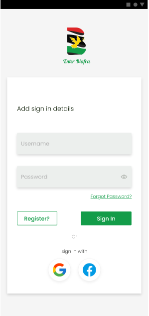 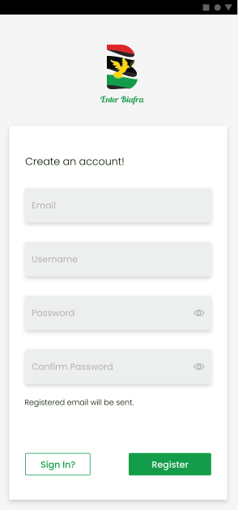 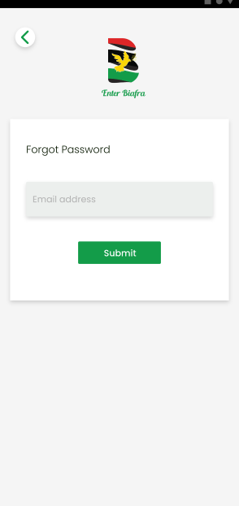 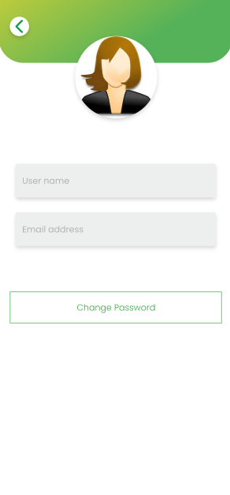  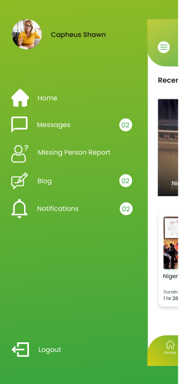 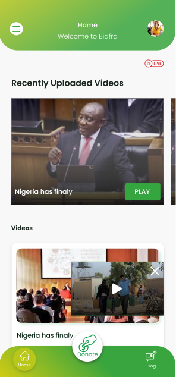 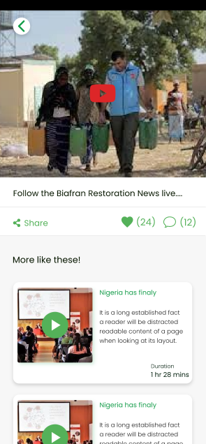 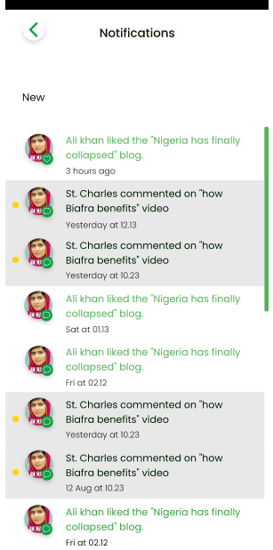 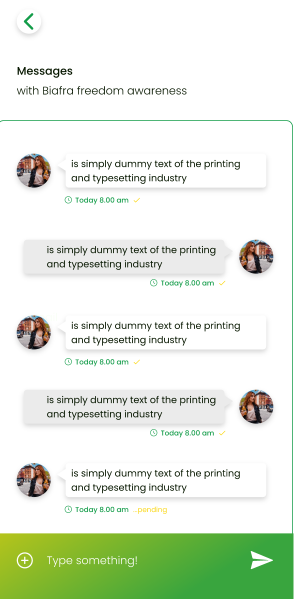 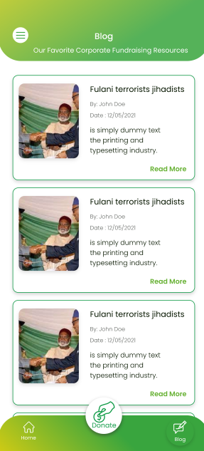 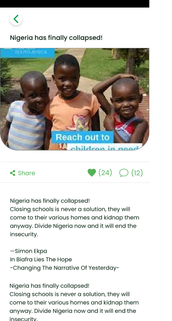 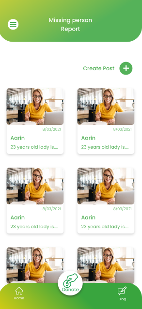 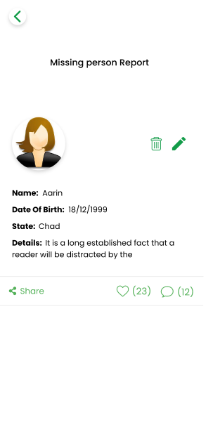  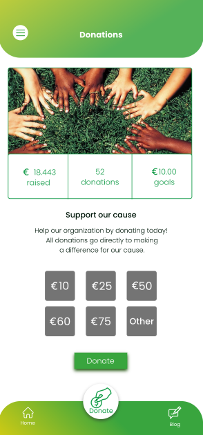 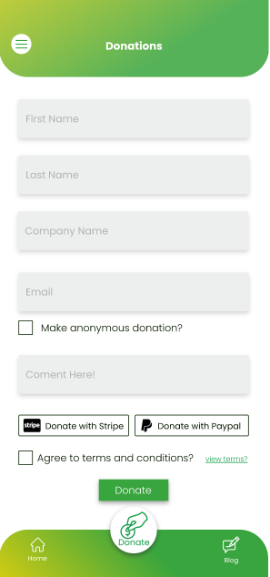 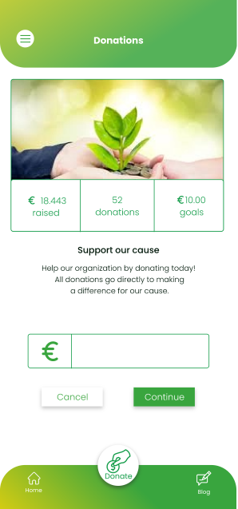 
